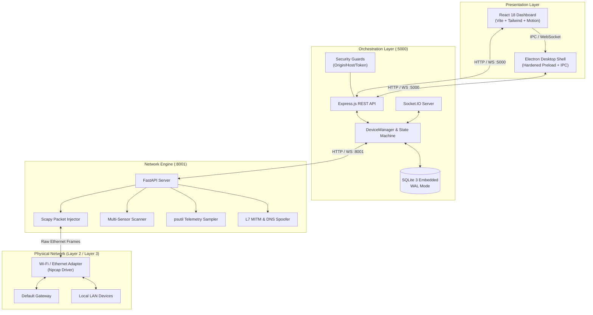

# Spoorf Sentinel (NetCut Sentinel)

<div align="center">


-10b981?style=for-the-badge&logo=checkmarx)


**Next-Gen Layer 2 Network Discovery, Telemetry, and Traffic Orchestration Engine**

[Features](#-core-features) • [Architecture](#-architecture) • [Quick Start](#-quick-start) • [Desktop App](#-desktop-packaging) • [API & Events](#-api--websocket-contracts) • [Security](#-security--ethical-disclaimer) • [Documentation](#-modular-specifications)

</div>

---

## 📌 Overview

**Spoorf Sentinel** is an advanced network control and observability suite designed for local area networks (Wi-Fi/Ethernet). Built on a **Hybrid Microservices Architecture**, it combines a high-performance Python/Scapy packet manipulation engine, an event-driven Node.js/TypeScript orchestration bridge, and a responsive React 18 / Electron desktop UI.

Whether performing network inventory discovery, analyzing bandwidth consumption in real-time, simulating network access disruptions (L2 ARP spoofing/PWM throttling), or deploying captive portal redirects, Spoorf Sentinel delivers zero-configuration convenience backed by rock-solid safety invariants.

---

## ✨ Core Features

### 🔍 1. Multi-Sensor Ensemble Discovery & Fingerprinting
- **Active & Passive Probing**: Blends ARP broadcast sweeps, SSDP UPnP multicast, mDNS/Bonjour discovery, NetBIOS node status (UDP 137), DHCP options/DUID snooping, and targeted TCP SYN port scanning.
- **Private MAC Synthesis**: Accurately tracks devices utilizing MAC randomization by synthesizing DHCP Option 61 / DUID, NetBIOS workgroups, and hostname signatures into persistent profile IDs.
- **IPv6 Neighbor Discovery (NDP)**: Discovers dual-stack devices with link-local and global IPv6 mapping.

### ⚡ 2. Layer 2 Traffic Control & PWM Bandwidth Throttling
- **Bidirectional ARP Poisoning**: Target $\leftrightarrow$ Gateway routing interception with sub-second cut precision.
- **PWM (Pulse-Width Modulation) Throttling**: Regulates target download/upload bandwidth between 0% and 100% via rapid duty-cycle ARP injection.
- **Safe & Instant Restoration**: Restores authentic gateway MAC tables cleanly without disconnecting legitimate network devices.
- **Auto-Reblock & Stale Retention**: Uses embedded SQLite (WAL mode) to automatically re-block targets on reconnect, while cleanly archiving stale guest devices (>14 days offline) to prevent ghost clutter.

### 📈 3. Sub-Second Real-Time Telemetry & Gaming Mode 2.0
- **Live Throughput Visualizer**: 1-second interval download/upload telemetry powered by native `psutil` sampling and smooth SVG live charts.
- **True ICMP RTT & Jitter Parser**: Real-time ping telemetry parsed directly from physical ICMP responses rather than CPU-skewed process timers.
- **Gaming Mode QoS 2.0**: Dual-mode engine (`auto_airtime` 20% limit & `blackhole_priority` 0% cut) with dynamic late-joiner throttling and hardcoded anti-self-cut protection.

### 🛡️ 4. Non-Negotiable Safety & Defense Invariants
- **Default Gateway Immunity (`is_gateway: true`)**: Hardcoded immunity preventing operators from accidentally cutting the router gateway.
- **Controller Self-Protection (`is_self: true`)**: Anti self-cut mechanism ensuring the host workstation adapter is never targeted.
- **Control-Plane IPC Security**: Exact-match CORS/Host validation and dynamic per-session bearer token (`SENTINEL_API_TOKEN`) preventing drive-by browser attacks or DNS rebinding.

### 🌐 5. DNS Spoofing & Redirection Suite
- **DNS Sinkhole & Regex Routing**: Redirects specific domain lookups to custom IPs or captive portal servers.
- **Captive Portal & Web Preview**: Serves local portal pages for authentication tests or device redirection.
- **L7 TLS Interception Engine**: Dynamic CA root generation and leaf certificate provisioning for deep traffic inspection.

---

## 🏗️ Architecture



### Microservice Components & Ports

| Service | Technology | Port | Directory | Role |
| :--- | :--- | :---: | :--- | :--- |
| **Python Service** | Python 3.11 + FastAPI + Scapy | `8001` | [`python-service/`](python-service/) | Raw packet injection, ARP spoofing, multi-sensor scanner, telemetry |
| **Node.js Orchestrator** | Node.js 20 + Express + Socket.IO | `5000` | [`backend-node/`](backend-node/) | Business logic, state management, SQLite persistence, auto-reblock |
| **Frontend Web** | React 18 + TypeScript + Vite | `5173` | [`frontend-react/`](frontend-react/) | Interactive UI, live charts, device table, settings |
| **Desktop Shell** | Electron 28 + electron-builder | Native | [`desktop-electron/`](desktop-electron/) | Standalone Windows desktop application installer (.exe) |

---

## 📂 Repository Directory Layout

```text
.
├── backend-node/               # Express + TypeScript orchestrator service (:5000)
│   ├── src/
│   │   ├── api/routes.ts       # REST API endpoint definitions
│   │   ├── services/           # DeviceManager, DatabaseService, PythonBridge
│   │   ├── websocket/          # Socket.IO streaming handlers
│   │   └── security.ts         # Host/Origin/Token guard validators
│   └── tests/                  # Automated integration and unit tests (34 tests)
│
├── python-service/             # Low-level network microservice (:8001)
│   ├── src/
│   │   ├── core/               # Spoofer, Scanner, Telemetry, Shield, Gaming
│   │   │   ├── discovery/      # ARP, DHCP, Multicast (SSDP/mDNS), IPv6 NDP
│   │   │   ├── fingerprint/    # Vendor OUI, NetBIOS, OS detection probes
│   │   │   ├── bettercap/      # DNS spoofer, SYN port scanner, packet sniffer
│   │   │   └── interceptor/    # TLS Dynamic CA & Leaf generator
│   │   ├── server.py           # FastAPI REST & WebSocket event endpoints
│   │   └── utils/              # Configuration and structured logging
│   └── tests/                  # PyUnit comprehensive test suite (162 tests)
│
├── frontend-react/             # React 18 + Tailwind CSS + Framer Motion UI (:5173)
│   ├── src/
│   │   ├── components/         # DeviceTable, NetworkBandwidthLineChart, Modals
│   │   ├── hooks/              # WebSocket hooks and reactive subscriptions
│   │   └── api/                # Axios backend API client
│   └── vite.config.ts          # Vite build and dev server configuration
│
├── desktop-electron/           # Native Windows desktop application wrapper
│   ├── src/                    # Electron main process & hardened preload
│   └── build/                  # NSIS custom installer scripts and prerequisites
│
├── docs/                       # Comprehensive specifications & runbooks
│   ├── SPECIFICATION.md        # Master system specification
│   ├── API_SPEC.md             # REST API & WebSocket contract dictionary
│   ├── DATABASE_SCHEMA.md      # SQLite schema & reconciliation logic
│   ├── DEPLOYMENT.md           # Production deployment & driver setup
│   ├── SECURITY_AUDIT.md       # Defensive threat modeling & audit report
│   ├── TROUBLESHOOTING.md      # Diagnostics and recovery guide
│   └── specs/                  # Deep modular specifications (SPEC-001 - SPEC-012)
│
├── scripts/                    # Utility scripts (Firewall configuration, setup)
├── AGENTS.md                   # Operational guide for AI coding assistants
├── CHANGELOG.md                # Comprehensive changelog and architectural decisions
├── LICENSE                     # MIT Open-Source License
└── SECURITY.md                 # Security policy, trust boundary, vulnerability reporting
```

---

## 🚀 Quick Start

### 1. Prerequisites
- **Operating System**: Windows 10 or Windows 11 (64-bit).
- **Npcap Driver**: Install [Npcap](https://npcap.com/#download) with the checkbox **"Install Npcap in WinPcap API-compatible Mode"** enabled.
- **Runtimes**: Node.js `>= 18.x`, Python `>= 3.10`.

### 2. Environment Setup

#### Python Network Service
```powershell
cd python-service
python -m venv venv
.\venv\Scripts\activate
pip install -r requirements.txt
```

#### Node.js Orchestrator
```powershell
cd ../backend-node
npm install
copy .env.example .env
```

#### Frontend Dashboard
```powershell
cd ../frontend-react
npm install
```

### 3. Launch Services (Development Mode)

Open terminal windows with **Administrator privileges** (required for raw packet injection):

```powershell
# Terminal 1: Python Engine (:8001)
cd python-service
.\venv\Scripts\python.exe -m uvicorn src.server:app --host 127.0.0.1 --port 8001

# Terminal 2: Node.js Orchestrator (:5000)
cd backend-node
npm run dev

# Terminal 3: React Dashboard (:5173)
cd frontend-react
npm run dev
```

Navigate to **`http://localhost:5173`** in your browser.

---

## 📦 Desktop Packaging (Electron .exe)

To package Spoorf Sentinel as a standalone Windows installer (`.exe` with bundled Python engine, Node runtime, and UI assets):

```powershell
# 1. Compile Python Engine with PyInstaller
cd python-service
python build_engine.py

# 2. Build Frontend Distribution
cd ../frontend-react
npm run build

# 3. Compile Backend and Package Installer
cd ../desktop-electron
npm install
npm run package
```

The output installer will be generated in `desktop-electron/dist-installer/Spoorf Sentinel Setup <version>.exe`.

---

## 🧪 Automated Testing & Verification

The repository includes a 100% automated test suite verifying every component from Scapy packet construction to SQLite state rollback:

```powershell
# Run Python Unit & Integration Tests (162 tests)
cd python-service
.\venv\Scripts\python.exe -m unittest discover -s tests -p "test_*.py" -v

# Run Node.js Orchestrator & Security Tests (34 tests)
cd ../backend-node
npm test
```

**Test Coverage Summary**:
- `162 / 162` Python Tests Passed (L2/L3 Spoofing, IPv6 NDP, SYN Scanner, TLS Interceptor, Shield, AP Isolation, True ICMP RTT)
- `34 / 34` Node.js Tests Passed (Auto-Reblock, Mutex Serialization, License Gating, Security Headers, Gaming Mode QoS, Stale Retention)
- **Total: 196 Automated Test Assertions**

---

## 🔌 API & WebSocket Contracts

### Key REST Endpoints

| Endpoint | Method | Description |
| :--- | :---: | :--- |
| `/api/scan` | `POST` | Triggers a multi-sensor ensemble network scan |
| `/api/devices` | `GET` | Returns list of all discovered devices in the active subnet |
| `/api/devices/:mac/block` | `POST` | Toggles L2 ARP spoofing cut for the target MAC |
| `/api/devices/:mac/limit` | `POST` | Applies PWM bandwidth limit percentage (`0%` - `100%`) |
| `/api/devices/:mac/redirect` | `POST` | Enforces captive portal or custom DNS redirection |
| `/api/telemetry` | `GET` | Fetches real-time Mbps throughput and gateway RTT |
| `/api/shield/toggle` | `POST` | Enables/disables Sentinel Shield passive ARP protection |
| `/api/interceptor/ca` | `GET` | Generates / downloads root CA certificate (`spoorf-ca.crt`) |

For the complete schema definitions and error codes, refer to [`docs/API_SPEC.md`](docs/API_SPEC.md).

---

## 🔒 Security & Ethical Disclaimer

> **IMPORTANT**: This software is developed strictly for **authorized network administration, authorized penetration testing, and educational research**. Executing Layer 2 network manipulation or ARP poisoning against networks or devices without explicit written authorization is illegal in most jurisdictions.

- **Private Subnet Scope**: The engine strictly limits operations to RFC 1918 private subnets (`10.0.0.0/8`, `172.16.0.0/12`, `192.168.0.0/16`).
- **Loopback-Only Binding**: In standalone development, backend services bind exclusively to `127.0.0.1`.
- **Hardened IPC**: All desktop IPC channels enforce origin matching and cryptographic session token verification.

For security policies and vulnerability reporting, see [`SECURITY.md`](SECURITY.md) and [`docs/SECURITY_AUDIT.md`](docs/SECURITY_AUDIT.md).

---

## 📚 Modular Specifications

Detailed architecture documents and specifications are available in the [`docs/`](docs/) directory:

- 📖 [`docs/SPECIFICATION.md`](docs/SPECIFICATION.md) — Master Architecture & Data Flow
- 🔌 [`docs/API_SPEC.md`](docs/API_SPEC.md) — Full REST API & WebSocket Event Dictionary
- 🗄️ [`docs/DATABASE_SCHEMA.md`](docs/DATABASE_SCHEMA.md) — SQLite Schema & Reconciliation Rules
- 🚀 [`docs/DEPLOYMENT.md`](docs/DEPLOYMENT.md) — Installation, Environment, and Troubleshooting
- 🛡️ [`docs/SECURITY_AUDIT.md`](docs/SECURITY_AUDIT.md) — Defensive Audit & Vulnerability Assessment
- 📁 [`docs/specs/`](docs/specs/) — Modular Technical Specifications (`SPEC-001` to `SPEC-012`)

---

## 📄 License

This project is licensed under the [MIT License](LICENSE) — see the [`LICENSE`](LICENSE) file for details.
