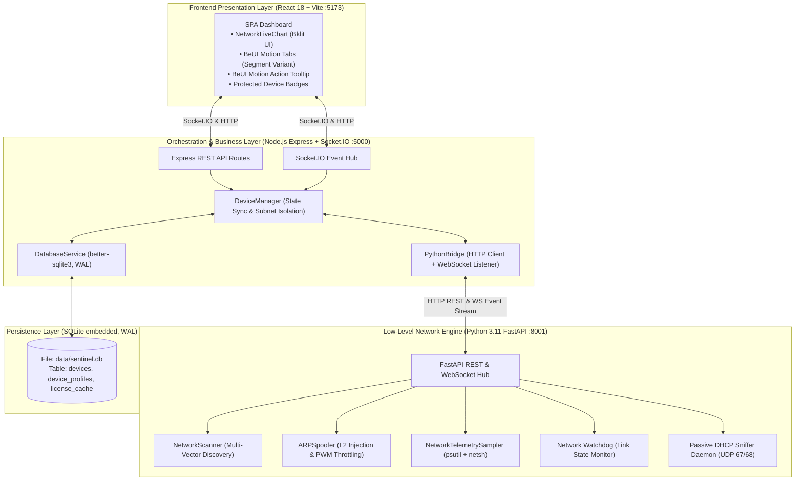

# NetCut Sentinel (Spoorf) - Master Technical Specification

Dokumen ini memuat **Spesifikasi Teknis Induk (Master Specification)** dari arsitektur sistem **NetCut Sentinel (Spoorf)**, mencakup ekosistem *Hybrid Microservices*, pipeline pemindaian multi-vektor, manipulasi paket Layer 2 dengan *Dual-Opcode Injection* & *Time-Slicing PWM Throttling*, telemetri waktu nyata natif, persistensi state **SQLite (better-sqlite3, WAL)** dengan *Auto-Reblock*, antarmuka pengguna responsif berbasis BeUI Motion, serta suite pengujian otomatis komprehensif.

---

## 1. Ikhtisar Arsitektur Sistem (System Architecture)

NetCut Sentinel mengadopsi pola arsitektur **Hybrid Microservices** yang memisahkan komputasi jaringan berkecepatan tinggi di level kernel OS dari orkestrasi bisnis dan antarmuka web:

---

## 2. Katalog Spesifikasi Teknis Rinci (Detailed Specifications)

Seluruh fitur teknis telah didokumentasikan secara mendalam ke dalam spesifikasi modular di folder [`docs/specs/`](specs/README.md):

| Spec ID | Nama Spesifikasi Teknis | Ringkasan Fungsionalitas |
| :--- | :--- | :--- |
| [**SPEC-001**](specs/SPEC-001_NETWORK_DISCOVERY_PIPELINE.md) | **Multi-Vector Network Discovery Pipeline** | Pipeline pemindaian 6 sensor (ARP Broadcast, Subnet Sweep, SSDP UPnP, mDNS Bonjour, NetBIOS NBNS, dan HTTP Banner Grabber) dengan waktu eksekusi < 2.5s. |
| [**SPEC-002**](specs/SPEC-002_DHCP_PASSIVE_PROFILING.md) | **Passive DHCP Sniffer & Option 53 Profiling** | Sniffer UDP 67/68 real-time yang mem-parsing Option 53 (State Handshake), Option 12 (Hostname), Option 60 (Vendor Class), dan Option 55 (PRL OS Signature). |
| [**SPEC-003**](specs/SPEC-003_ARP_SPOOFING_AND_THROTTLING.md) | **ARP Spoofing & PWM Bandwidth Throttling** | Injeksi ganda (*Dual-Opcode* `is-at` + `who-has`), Initial Burst Latching, algoritma *Time-Slicing PWM Duty-Cycle* (0-100%), dan lock non-blocking. |
| [**SPEC-004**](specs/SPEC-004_STATE_PERSISTENCE_AND_AUTOREBLOCK.md) | **State Persistence & Auto-Reblock Pipeline** | Persistensi skema SQLite (better-sqlite3, WAL), penandaan alias kustom, serta eksekusi otomatis Auto-Reblock (limit 0%) dan Auto-Throttle (limit 1-99%) saat target reconnect. |
| [**SPEC-005**](specs/SPEC-005_REALTIME_TELEMETRY_AND_WATCHDOG.md) | **Hardware Telemetry & Network Watchdog** | Perhitungan throughput download/upload Mbps dari hardware Windows, latensi RTT gateway, dan watchdog pendeteksi pergantian Wi-Fi / roaming. |
| [**SPEC-006**](specs/SPEC-006_FRONTEND_UI_AND_INTERACTION.md) | **Modern Frontend UI, Tabs & Action Tooltips** | BeUI Segment Tabs dengan spring layout indicator (`layoutId`), filter 4 tab (All, Online, Dibatasi, Blocked), 3-action floating tooltip, dan Protected badge. |
| [**SPEC-007**](specs/SPEC-007_AUTOMATED_TESTING_SUITE.md) | **Automated Testing Architecture & QA Suite** | Arsitektur pengujian 53 test cases (Happy Path, Negative Tests, Edge Cases) yang mencakup Unit, Concurrency, API, Database, dan Validation testing. |

---

## 3. Matriks Protokol Jaringan & Standar RFC

| Protokol | Port / Layer | Standar RFC | Penggunaan dalam NetCut Sentinel |
| :--- | :---: | :---: | :--- |
| **ARP** | Data Link (Layer 2) | RFC 826 | Pemetaan IP ke MAC, Broadcast Discovery, dan Injeksi Poisoning ganda. |
| **DHCP / BOOTP** | UDP 67 & 68 (L4/L7) | RFC 2131, RFC 2132 | Passive Device Sniffing, Option 53 Message Type, PRL OS Fingerprinting. |
| **SSDP (UPnP)** | UDP 1900 (Multicast) | ISO/IEC 29341 | Penemuan Smart TV, Router, Printer, dan Media Renderer. |
| **mDNS (Bonjour)**| UDP 5353 (Multicast)| RFC 6762, RFC 6763 | Penemuan perangkat Apple (iOS/macOS), Chromecast, dan IoT. |
| **NetBIOS (NBNS)** | UDP 137 | RFC 1001, RFC 1002 | Resolusi nama komputer Windows asli, workgroup, dan active user. |
| **ICMP** | Internet (Layer 3) | RFC 792 | Fast Ping RTT latency measurement dan OS TTL fingerprinting. |
| **IPv4 Private** | Network (Layer 3) | RFC 1918 | Validasi ketat batas subnet private (`10.0.0.0/8`, `172.16.0.0/12`, `192.168.0.0/16`). |

---

## 4. Prinsip Keamanan & Ketahanan Sistem (*Safety Guardrails*)

1. **Anti Operator Lockout (`is_self`)**:
   - Host controller operator dikenali otomatis dari adapter aktif.
   - Tombol putus koneksi dinonaktifkan secara permanen untuk host operator guna mencegah terputusnya akses sendiri secara tidak sengaja (*anti self-cut*).
2. **Gateway Immunity (`is_gateway`)**:
   - Default router gateway selalu diberi tanda `is_gateway: true` dan dikecualikan dari segala bentuk manipulasi pemblokiran atau pemotongan bandwidth.
3. **Pembersihan Restorasi Instan (*Graceful Shutdown*)**:
   - Ketika proses backend dimatikan atau saat menerima sinyal `SIGINT`/`SIGTERM`, sistem secara otomatis memancarkan 6 paket restorasi ARP asli beruntun ke seluruh sesi yang aktif untuk memastikan tidak ada perangkat yang tertinggal dalam kondisi terputus.
4. **Isolasi Subnet Otomatis**:
   - Saat berpindah access point Wi-Fi, watchdog mendeteksi perubahan IP gateway dalam interval 10 detik, memutus semua sesi lama, me-refresh interface Scapy, dan mengisolasi tabel antarmuka hanya untuk perangkat di subnet baru.
5. **Exact-Match Origin/Host (anti drive-by & DNS-rebinding) — P1**:
   - Backend Node hanya menerima Origin/Host loopback yang **dicocokkan eksak** (bukan prefix), menutup celah `http://localhost.evil.com`. Lihat `security.ts`.
6. **IPC Bearer Token (control-plane auth) — P1**:
   - Bila `SENTINEL_API_TOKEN` aktif (di-generate Electron), setiap request ke Node (:5000) & Python (:8001) wajib menyertakan `x-sentinel-token`; endpoint `/health` tetap terbuka. Mengunci control-plane dari proses lokal lain.
7. **Validasi Parameter Gateway + Eksekusi Tanpa Shell — P1**:
   - `victim_ip/mac` **dan** `gateway_ip/mac` divalidasi (RFC 1918 / format MAC) sebelum paket/perintah dibangun; seluruh pemanggilan `netsh`/PowerShell memakai argument-list (`shell=False`) — menutup command injection.

> **Catatan restorasi ARP saat exit:** Jalur graceful-shutdown Electron kini memanggil `/api/spoof/stop_all` (underscore) yang benar; sebelumnya salah tulis `stop-all` sehingga restorasi bisa terlewat.
