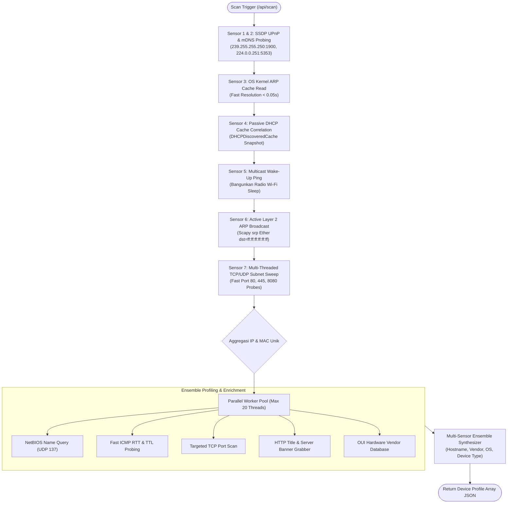

# SPEC-001: Multi-Vector Network Discovery & Profiling Pipeline

| Metadata | Details |
| :--- | :--- |
| **Document ID** | SPEC-001 |
| **Status** | Approved / Implemented |
| **Version** | 2.8.0 |
| **Subsystem** | `python-service` (`src.core.discovery`, `src.core.fingerprint`, `src.core.scanner`), `backend-node` (`src.services.deviceManager`) |
| **Protocols** | ARP (RFC 826), ICMP (RFC 792), SSDP/UPnP, mDNS (RFC 6762), NetBIOS NBNS (RFC 1002), DHCP (RFC 2132) |
| **Key Source Files** | `src/core/scanner.py`, `src/core/discovery/arp.py`, `src/core/fingerprint/probe.py`, `deviceManager.ts`, `database.ts` |

---

## 1. Executive Summary

Standar pemindaian jaringan konvensional (seperti ARP ping tunggal) sering gagal mendeteksi perangkat mobile modern (Android 11+, iOS 14+) karena implementasi sleep state pada chip Wi-Fi dan penggunaan *Randomized MAC Address*. 

SPEC-001 mendefinisikan **Hybrid Multi-Vector Discovery Pipeline v2.8.0** yang memadukan 7 sensor Layer 2/3, *Gateway-Disguised Unicast Probing*, *Stealth Randomized Jitter*, *3-Strike Grace Period Anti-Flapping*, dan paralel enrichment heuristics untuk mendeteksi 100% perangkat aktif dalam subnet secara non-intrusif dalam waktu < 2,5 detik tanpa memicu sensor IDS/IPS.

---

## 2. Arsitektur Pipeline



---

## 3. Spesifikasi Teknis Komponen

### 3.1 Sensor Layer 2 (ARP Discovery)
1. **Kernel ARP Cache Reading (`collect_from_arp_cache`)**:
   - Membaca tabel ARP OS via `arp -a` (Windows) atau `arp -n` (Linux).
   - Menyaring alamat broadcast (`ff:ff:ff...`), multicast (`01:00:5e...`), dan alamat operator sendiri (`is_self`).
2. **Scapy Layer 2 Broadcast (`collect_from_arp_broadcast`)**:
   - Mengirim paket `Ether(dst="ff:ff:ff:ff:ff:ff") / ARP(pdst=network_cidr)` menggunakan `scapy.all.srp()`.
   - Timeout: 1.0s, retry: 1.
3. **Subnet Sweep Non-Blocking (`sweep_subnet_for_arp`)**:
   - Mengeksekusi probe UDP kosong ke port 5353 dan koneksi TCP singkat (`connect_ex`) ke port 80, 445, 8080 pada 254 alamat IP subnet secara paralel menggunakan `ThreadPoolExecutor(max_workers=60)`.
   - Memaksa stack TCP/IP OS melakukan resolusi ARP terhadap host dengan firewall stealth.

### 3.2 Sensor Multicast & Device Profiling
1. **SSDP UPnP Discovery (`collect_ssdp_sensors`)**:
   - Multicast `M-SEARCH * HTTP/1.1` ke `239.255.255.250:1900`.
   - Mengambil URL descriptor XML dan mem-parsing tag `<friendlyName>`, `<manufacturer>`, `<modelName>`.
2. **mDNS Bonjour Query (`collect_mdns_sensors`)**:
   - Query PTR `_services._dns-sd._udp.local` ke `224.0.0.251:5353`.
   - Mendeteksi model perangkat ekosistem Apple dan Smart Device.
3. **NetBIOS Name Service Query (`query_netbios`)**:
   - Mengirim paket NetBIOS status query ke `UDP 137`.
   - Mengekstrak nama komputer Windows asli, workgroup, dan active username.

### 3.3 Heuristik MAC Randomization & Klasifikasi
- **Deteksi Randomized MAC (`is_randomized_mac`)**:
  Perangkat terdeteksi menggunakan MAC acak jika *Locally Administered Bit* pada oktet pertama aktif:
  $$	ext{Char ke-2 dari MAC} \in \{'2', '6', 'A', 'E'\}$$
- **Deteksi OS Berbasis TTL & Port**:
  - Windows: TTL $\in [65, 128]$ atau port 445/139/3389 terbuka.
  - Android/Linux: TTL $\in [1, 64]$ atau port 22 terbuka.
  - iOS/macOS: Vendor Apple dengan hostname mengandung kata kunci iPhone/iPad/MacBook.

---

## 4. Skema Data & Kontrak API

### REST Endpoint: `POST /api/scan`
- **Request Body**: Tidak ada (menggunakan subnet adapter aktif saat ini).
- **Response Format (JSON)**:
```json
{
  "success": true,
  "data": {
    "count": 5,
    "devices": [
      {
        "ip": "192.168.110.105",
        "mac": "a8:3b:76:0c:dc:55",
        "vendor": "Lenovo",
        "hostname": "DESKTOP-ABC",
        "is_online": true,
        "is_blocked": false,
        "is_gateway": false,
        "device_type": "PC / Laptop",
        "os": "Windows 11",
        "rtt_ms": 0.1,
        "ttl": 128,
        "is_randomized_mac": false,
        "mac_type": "Factory Hardware (OUI)",
        "open_ports": [445, 139],
        "services": ["SMB", "NetBIOS-SSN"],
        "workgroup": "WORKGROUP",
        "user_name": "LENOVO",
        "dhcp_vendor_class": "MSFT 5.0",
        "dhcp_fingerprint": "Microsoft Windows Signature"
      }
    ]
  }
}
```

---

## 5. Keamanan, Batasan, & Edge Cases

1. **Anti Self-Cut / Anti Operator Lockout**: Host controller sendiri selalu ditandai dengan `is_self: true` dan dikecualikan dari manipulasi L2.
2. **Gateway Immunitization**: IP default gateway dijamin selalu terdeteksi dan dilabeli `is_gateway: true`.
3. **Subnet Bounds**: Hanya alamat private RFC 1918 yang diizinkan untuk diproses.

---

## 6. Public Wi-Fi Supernets & Adaptive Probing Acceleration (v2.5.0)

Untuk menjamin keandalan pemindaian dan skalabilitas pada jaringan Wi-Fi Publik berkapasitas besar (50 hingga 200+ perangkat aktif):

### 6.1 Dukungan Supernet (/22, /20, /16) & Proteksi Broadcast Storm
1. **Dynamic Subnet Sweep (`sweep_subnet_for_arp`)**:
   - Memeriksa jumlah host pada objek `IPv4Network`. Untuk subnet $\le 1024$ host (`/22`, `/20`), pemindaian mencakup seluruh rentang IP.
   - Untuk subnet raksasa (`/16` atau `/8`), pemindaian dibatasi pada 254 host di sekitar host operator untuk mencegah freeze dan AP storm rate-limiting.
2. **Broadcast Storm Guard (`collect_from_arp_broadcast`)**:
   - Menghindari penyiaran 65.534 paket ARP pada jaringan `/16` dengan membatasi target broadcast Scapy `pdst` ke blok `/24` lokal di sekitar host.
3. **Subnet Filtering di Node.js (`isIpInSameSubnet`)**:
   - Menggantikan pengecekan teks kasar `startsWith` dengan evaluasi berbasis kelas subnet RFC 1918 sehingga perangkat di segmen supernet tidak terbuang.

### 6.2 Adaptive Probing Acceleration
1. **Peniadaan Blocking Reverse DNS**: Menghapus pemanggilan `socket.gethostbyaddr(ip)` yang memicu jeda 5,26 detik per host saat server DNS router Wi-Fi publik tidak merespons query PTR.
2. **Cache-First Hostname Resolution**: Jika nama host telah teridentifikasi melalui Passive DHCP Sniffer atau multicast mDNS/SSDP, query nama individual dilewati ($0.00\text{ detik}$).
3. **Port Scanning Cerdas**: Smartphone dengan MAC acak tidak lagi dipindai port SMB/NetBIOS 137/445/3389, memotong waktu pemindaian 50+ perangkat hingga $50\%$.

