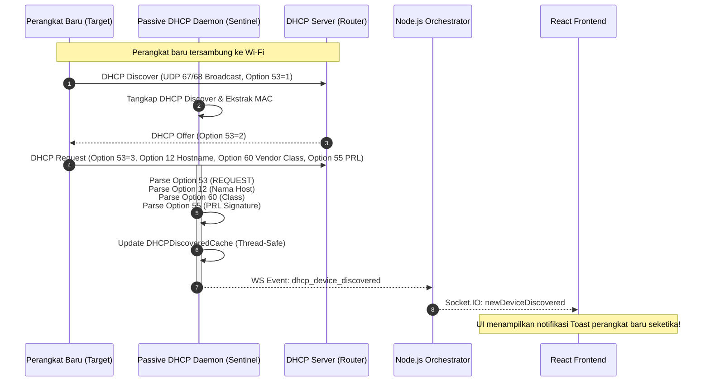

# SPEC-002: Passive DHCP Sniffer Daemon & Option 53 Zero-Second Profiling

| Metadata | Details |
| :--- | :--- |
| **Document ID** | SPEC-002 |
| **Status** | Approved / Implemented |
| **Version** | 2.1.0 |
| **Subsystem** | `python-service` (`src.core.discovery.dhcp`), `backend-node` (`src.services.deviceManager`) |
| **Protocols** | DHCP / BOOTP (RFC 2131, RFC 2132), UDP Ports 67 & 68 |
| **Key Source Files** | `src/core/discovery/dhcp.py`, `src/server.py`, `src/services/deviceManager.ts` |

---

## 1. Executive Summary

Metode pemindaian aktif polling memerlukan interval waktu tertentu (misal tiap 5-10 detik) sehingga menimbulkan *blind spot* ketika ada perangkat baru yang baru saja terhubung ke Wi-Fi.

SPEC-002 mengimplementasikan **Passive DHCP Sniffer Daemon** yang mendengarkan paket siaran DHCP pada port UDP 67/68 secara *real-time*. Begitu perangkat meminta IP dari router, sistem mengekstrak parameter identitas perangkat dari opsi DHCP sebelum perangkat tersebut sempat menyelesaikan handshake internetnya.

---

## 2. Alur Interaksi & Siklus Hidup DHCP



---

## 3. Spesifikasi Parsing DHCP Options

Daemon mem-parsing opsi-opsi kritis berikut sesuai RFC 2132:

| DHCP Option | Nama Opsi | Tipe Data | Kegunaan dalam Sentinel |
| :---: | :--- | :--- | :--- |
| **Option 53** | `DHCP Message Type` | Byte (1-8) | Menentukan status koneksi (1: DISCOVER, 3: REQUEST, 5: ACK, 7: RELEASE - *Instant Disconnect*). |
| **Option 54** | `Server Identifier` | IPv4 Address | IP server DHCP pengirim untuk validasi **Rogue DHCP Detection**. |
| **Option 12** | `Host Name` | String UTF-8 | Nama asli perangkat yang diatur pengguna di HP/Laptop (misal: `Galaxy-A52`, `iPhone-Naim`). |
| **Option 60** | `Vendor Class Identifier` | String | Identifikasi OS/Vendor asli (misal: `android-dhcp-14`, `MSFT 5.0`, `PlayStation 5`). |
| **Option 55** | `Parameter Request List` | Array Byte | *Fingerprint unik* susunan permintaan parameter IP OS (PRL Signature). |
| **Option 51** | `IP Lease Time` | 32-bit UInt / Bytes | Waktu sewa IP (dengan overflow guard `0xFFFFFFFF` $\le 30$ hari). |
| **Option 3** | `Router / Gateway` | IPv4 / Tuple | IP default gateway dari router untuk verifikasi telemetri pasif. |
| **Option 61** | `Client Identifier` | Hex String | DUID / Hardware ID klien unik. |
| **Option 81** | `Client FQDN` | String | Nama domain lokal lengkap perangkat (misal: `laptop.local`). |

### 3.1 Deterministic Parameter Request List (PRL) Matrix
Urutan permintaan opsi DHCP (Option 55) bersama Option 60 dianalisis secara deterministik:
- **Apple iOS (iPhone / iPad)**: String opsi diawali `1,121,3,6,15` atau memuat hostname bertipe iPhone/iPad.
- **Apple macOS (MacBook / iMac)**: String opsi diawali `1,3,6,15,119,252` atau memuat hostname bertipe Mac.
- **Android OS**: Mengandung kombinasi opsi `26,28,51,58,59` atau Vendor Class `android-dhcp-*` (dengan versi granular).
- **Microsoft Windows**: Mengandung kombinasi opsi `31,33,43,44,46,47` atau `44,46,47,252` atau Vendor Class `MSFT 5.0`.
- **Sony PlayStation & Nintendo**: Tanda tangan `PlayStation` / `Nintendo` pada Vendor Class & PRL `1,3,6,15,28,33,43`.
- **Linux Embedded / IoT**: Pola `1,3,6,12,15,28` atau `1,28,2,3,15,6,119,12` atau `udhcp`/`dhcpcd`.

---

## 4. Keamanan, Anti-Kontaminasi & Thread-Safety (v2.7.0 Defensive Guardrails)

State hasil sniffing disimpan dalam kelas `DHCPDiscoveredCache` yang ditingkatkan dengan mekanisme pertahanan:
1. **Deteksi Rogue DHCP Server (Opsi 54)**:
   - Jika paket balasan `DHCP OFFER` atau `DHCP ACK` memuat `server_id` yang berbeda dari IP Gateway resmi (`router_ip`) dan bukan IP host controller, sistem menandai `is_rogue_dhcp = True` dan memicu alarm keamanan seketika.
2. **Instant Offline State Transition via `DHCP RELEASE`**:
   - Menangkap paket `DHCP RELEASE` (Opsi 53 = 7) saat perangkat memutus sambungan Wi-Fi, seketika mengubah status perangkat menjadi `Offline` tanpa menunggu polling scan.
3. **Kunci Primer Berbasis MAC (*MAC-Centric Primary Storage*)**:
   - `_cache_by_mac`: MAC address (termasuk *Per-SSID Persistent Randomized MAC*) menjadi jangkar tunggal identitas perangkat.
   - `_ip_to_mac`: Pemetaan dinamis IP $\rightarrow$ MAC untuk mencegah kontaminasi antar-perangkat (*IP churn*).
4. **Smart Merge Data**:
   - Mempertahankan metadata nama host/fingerprint lama jika paket baru tidak memuat opsi tersebut.
5. **Batas Memori LRU (Maksimal 300 Perangkat)**:
   - Mencegah kebocoran memori di jaringan ramai dengan membuang entri dengan `last_seen` tertua saat kapasitas penuh.
6. **Sniffer Kontinu & Self-Packet Loopback Wakeup**:
   - Mendengarkan tanpa batas waktu dan menggunakan *loopback dummy packet* port 67 untuk penghentian instan ($< 50\text{ms}$).

---

## 5. Event Stream & Integrasi WebSocket

### 5.1 WebSocket Event Payload: `dhcp_device_discovered`
```json
{
  "event": "dhcp_device_discovered",
  "data": {
    "mac": "c2:4e:ca:88:04:2d",
    "ip": "192.168.110.120",
    "hostname": "Infinix-HOT-10",
    "vendor_class": "android-dhcp-10",
    "dhcp_fingerprint": "Android OS Signature (android-dhcp-10)",
    "lease_time": "86400s (24.0h)",
    "router_ip": "192.168.110.1",
    "server_id": "192.168.110.1",
    "is_rogue_dhcp": false,
    "is_release": false,
    "client_id": "01:c2:4e:ca:88:04:2d",
    "fqdn": "Infinix-HOT-10.local",
    "message_type": "REQUEST",
    "message_type_code": 3,
    "last_seen": "2026-08-28 13:40:00"
  }
}
```

### 5.2 WebSocket Event Payload: `rogue_dhcp_detected`
```json
{
  "event": "rogue_dhcp_detected",
  "data": {
    "server_ip": "192.168.1.250",
    "server_mac": "de:ad:be:ef:00:01",
    "gateway_ip": "192.168.1.1",
    "message": "Rogue DHCP Server terdeteksi pada IP 192.168.1.250 (MAC: de:ad:be:ef:00:01)"
  }
}
```
