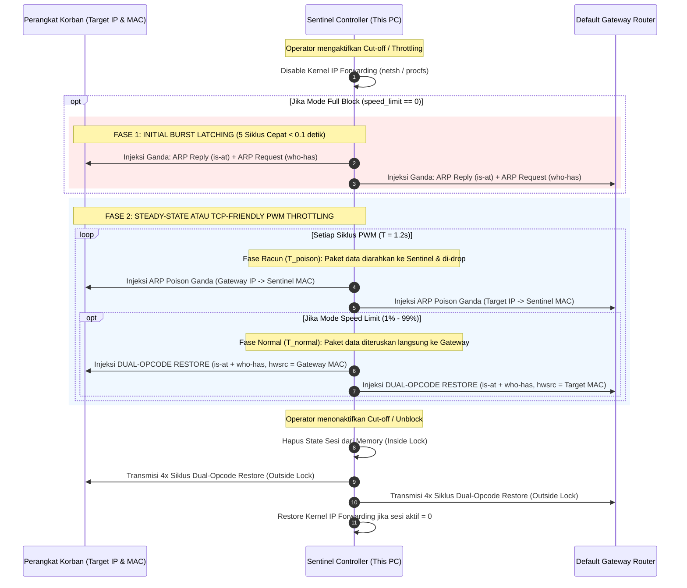

# SPEC-003: High-Performance ARP Spoofing & PWM Bandwidth Throttling

| Metadata | Details |
| :--- | :--- |
| **Document ID** | SPEC-003 |
| **Status** | Approved / Implemented |
| **Version** | 2.3.0 |
| **Subsystem** | `python-service` (`src.core.spoofer`), `backend-node` (`src.services.deviceManager`) |
| **Protocols** | Ethernet II, ARP (RFC 826), IPv4 (RFC 791) |
| **Key Source Files** | `src/core/spoofer.py`, `src/services/deviceManager.ts`, `src/api/routes.ts` |

---

## 1. Executive Summary

Pemutusan dan pembatasan bandwidth internet dalam jaringan Wi-Fi lokal dilakukan pada **Data Link Layer (Layer 2)** tanpa memerlukan akses administratif ke router gateway. 

SPEC-003 menetapkan arsitektur **Bidirectional ARP Cache Poisoning** yang dilengkapi dengan **Dual-Opcode Injection**, fase **Initial Burst Latching kondisional**, **Dual-Opcode Restoration**, dan algoritma pembatasan kecepatan bertahap berbasis **TCP-Friendly Pulse Width Modulation (PWM)**, serta model sinkronisasi non-blocking yang menjamin kestabilan microservice tanpa *lock contention*.

---

## 2. Arsitektur ARP Spoofing Layer 2

---

## 3. Spesifikasi Dual-Opcode Injection & Restoration

Sistem operasi mobile modern (Android 11+, iOS 14+, Linux Kernel 5.4+) menerapkan proteksi kernel terhadap *unsolicited ARP reply* (paket ARP reply yang datang tanpa didahului request). Untuk menjamin pembaruan tabel ARP target 100% efektif baik saat **meracuni** maupun saat **memulihkan**:

1. **Dual-Opcode Poison (Fase Racun)**:
   - **ARP Reply (`op="is-at"`, Code 2)**: `psrc = Gateway IP`, `hwsrc = Sentinel MAC`.
   - **ARP Request (`op="who-has"`, Code 1)**: `psrc = Gateway IP`, `hwsrc = Sentinel MAC`. Memaksa kernel target meracuni tabel ARP-nya sesuai RFC 826.
2. **Dual-Opcode Restore (Fase Normal & Teardown)**:
   - **ARP Reply (`op="is-at"`, Code 2)**: `psrc = Gateway IP`, `hwsrc = Gateway MAC Asli`.
   - **ARP Request (`op="who-has"`, Code 1)**: `psrc = Gateway IP`, `hwsrc = Gateway MAC Asli`.
   - **Penting:** Injeksi `who-has` pada pemulihan mengeliminasi *bug* di mana Android 11+ mengabaikan paket pemulihan biasa dan tetap mati total $100\%$ saat di-throttle.

---

## 4. Algoritma Pembatasan Bandwidth (TCP-Friendly PWM Duty-Cycle)

Alih-alih memutus total, sistem menyediakan opsi persentase kecepatan ($0\% \le \text{limit} \le 100\%$):

### Formula Matematis Time-Slicing v2.3.0
Diberikan periode siklus total $T_{\text{cycle}} = 1.2\text{ detik}$:
1. **Rasio Racun Non-Linier (*Poison Ratio*)**:
   $$R_p = \max\left(0.15, \min\left(0.85, \frac{100 - \text{speed\_limit}}{100} \times 0.85\right)\right)$$
2. **Durasi Fase Poison ($T_p$)**:
   $$T_p = \max(0.15, T_{\text{cycle}} \times R_p)$$
3. **Durasi Fase Normal / Restored ($T_n$)**:
   $$T_n = \max(0.25, T_{\text{cycle}} \times (1.0 - R_p))$$

| Mode | `speed_limit` | Perilaku Loop |
| :--- | :---: | :--- |
| **Full Cut-Off (Blocked)** | $0\%$ | Initial burst 5 paket aktif. Injeksi racun konstan dengan jitter acak $\pm 0.05\text{s}$. Drop 100% paket. |
| **Throttled (Dibatasi)** | $1\% - 99\%$ | Initial burst di-bypass. Siklus PWM 1.2s bergantian antara fase racun ($T_p$) dan fase pemulihan ganda ($T_n$). |
| **Unrestricted (Bebas)** | $100\%$ | Tidak ada paket racun yang diinjeksikan. Sesi berada dalam mode siaga (*standby*). |

---

## 5. Model Konkurensi Bebas Lock Contention

Pada implementasi arsitektur modular v2.1, operasi `spoofer.stop()` dipecah menjadi dua tahap:
1. **Tahap Mutasi Internal (Di dalam `self._lock`)**:
   - Menghapus entri sesi dari kamus `self._sessions`, `self._threads`, dan mengaktifkan `stop_event.set()`.
   - Durasi penahanan lock: $< 0.1	ext{ milidetik}$.
2. **Tahap Restorasi Jaringan (Di luar `self._lock`)**:
   - Transmisi 6 paket restorasi ARP ke interface fisik dengan `time.sleep(0.04)` (total $pprox 0.24	ext{ detik}$) dijalankan sepenuhnya di luar mutex.
   - **Hasil:** Endpoint status REST API dan thread spoofing lainnya tidak pernah mengalami *blocking* atau *freezing*.

---

## 6. Invariant Validasi Input & Eksekusi Aman (P1 — 2026-08-31)

`ARPSpoofer.start()` menolak (`SpoofError`) sebelum paket apa pun dibangun bila parameter tidak sah. Sejak perbaikan Prioritas-1, validasi mencakup **victim DAN gateway** (sebelumnya hanya victim):

| Parameter | Validasi | Sumber |
| :--- | :--- | :--- |
| `victim_ip` | RFC 1918 (`is_valid_private_ip`) | `network.py` (via `ipaddress.IPv4Address`) |
| `victim_mac` | Format 6-oktet (`is_valid_mac`, regex) | `network.py` |
| `gateway_ip` | RFC 1918 (`is_valid_private_ip`) — **baru (P1)** | `network.py` |
| `gateway_mac` | Format 6-oktet (`is_valid_mac`) — **baru (P1)** | `network.py` |

**Eksekusi perintah OS tanpa shell (anti command-injection).** Fungsi yang menyentuh `netsh`/PowerShell (`_ensure_host_gateway_locked` di `spoofer.py`; `_resolve_gateway_mac`, `_lock_kernel_neighbor`, `_unlock_kernel_neighbor` di `shield.py`) kini:
1. Memvalidasi ulang `gateway_ip`/`gateway_mac` di awal (fail-safe), lalu
2. Memanggil `subprocess.run([...], shell=False)` dengan **argument list** (bukan string `shell=True`), sehingga metakarakter shell pada input mustahil dieksekusi.

> **Perbaikan bug laten:** `spoofer.py` sebelumnya memakai `subprocess` **tanpa meng-import**-nya, sehingga `_ensure_host_gateway_locked` selalu `NameError` (tertelan `try/except`) dan penguncian ARP gateway di kernel **tidak pernah aktif**. `import subprocess` kini ditambahkan.

Invariant lama tetap berlaku: **Gateway Immunity** (victim == gateway ditolak, termasuk terhadap gateway sistem aktual) dan **Anti Self-Cut** (victim == IP/MAC controller ditolak).
