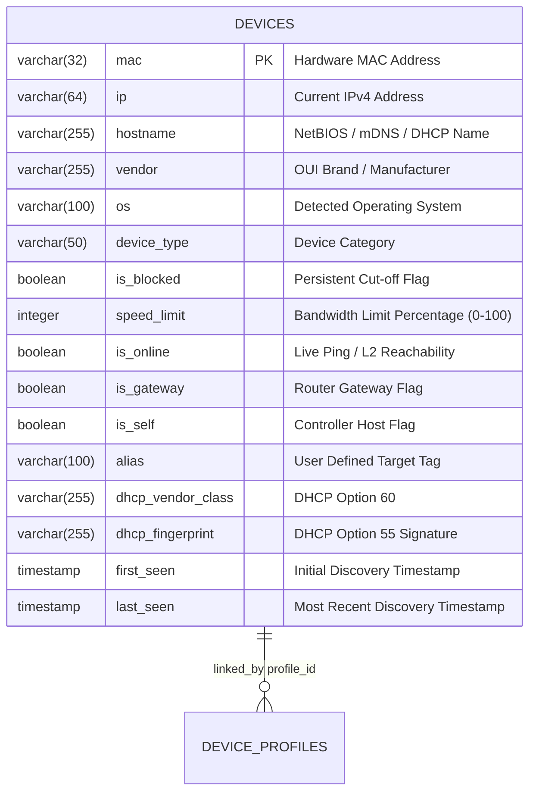
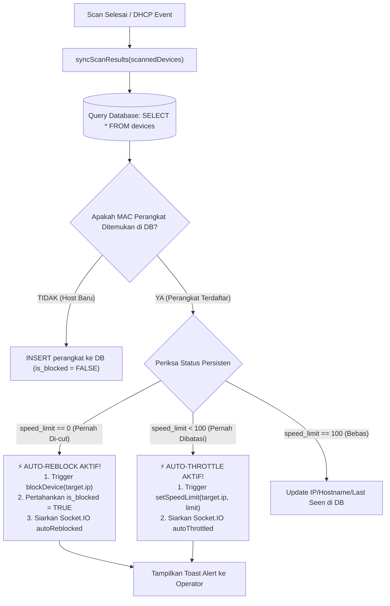

# SPEC-004: Database State Persistence, Device Aliasing & Auto-Reblock

| Metadata | Details |
| :--- | :--- |
| **Document ID** | SPEC-004 |
| **Status** | Approved / Implemented |
| **Version** | 2.4.0 |
| **Subsystem** | `backend-node` (`src.services.database`, `src.services.deviceManager`), `frontend-react` |
| **Database Engine** | **SQLite** (`better-sqlite3`, mode WAL, zero-config, file `data/sentinel.db`) |
| **Key Source Files** | `src/services/database.ts`, `src/services/deviceManager.ts`, `DeviceTable.tsx` |

> **Catatan penyelarasan kode (2026-08-31):** Implementasi aktual memakai **SQLite** melalui `better-sqlite3` (embedded, tanpa server, WAL). Referensi PostgreSQL/`pg-pool` pada revisi dokumen lama adalah sisa migrasi dan **tidak lagi berlaku**. DDL otoritatif ada di [`docs/DATABASE_SCHEMA.md`](../DATABASE_SCHEMA.md).

---

## 1. Executive Summary

Pengguna sering kali mematikan Wi-Fi, mengubah IP, atau keluar dari jangkauan sinyal untuk menghindari pemutusan internet. Tanpa persistensi database, setiap kali dilakukan scan ulang atau server di-restart, seluruh riwayat konfigurasi target akan hilang.

SPEC-004 menetapkan arsitektur persistensi **SQLite (better-sqlite3, WAL)** yang menjamin **kekekalan status pembatasan (*state persistence*)**, penandaan identitas kustom (*Device Aliasing*), serta eksekusi otomatis **Auto-Reblock** dan **Auto-Throttle** tanpa memerlukan intervensi ulang dari operator. Karena embedded, database tidak memerlukan instalasi/port terpisah (zero-config).

---

## 2. Skema Relasional Database (SQLite)

> Diagram di bawah bersifat semantik. Pada SQLite, tipe memakai *type affinity*: kolom string = `TEXT`, angka = `INTEGER`/`REAL`, boolean disimpan sebagai `INTEGER` (0/1), dan timestamp sebagai `TEXT` (`datetime('now','localtime')`). Primary key = `mac TEXT PRIMARY KEY`. DDL lengkap ada di [`docs/DATABASE_SCHEMA.md`](../DATABASE_SCHEMA.md).



---

## 3. Pipeline Rekonsiliasi Data & Auto-Reblock Engine



---

## 4. Keamanan & Perlindungan Data

1. **Pencegahan SQL Injection**: Seluruh operasi manipulasi database pada `DatabaseService` menggunakan **prepared statement berparameter** (placeholder `?`) bawaan `better-sqlite3` (`db.prepare(...).run(...)`). String berbahaya seperti `' OR '1'='1; --` diperlakukan sebagai nilai data, bukan SQL. (Diverifikasi pada audit 2026-08-31: tidak ada interpolasi string ke dalam SQL — satu-satunya nilai non-parameter adalah konstanta numerik `OFFLINE_GRACE_SECONDS`.)
2. **Validasi Batas Nilai (*Value Constraints*)**:
   - `alias`: Dipotong maksimal 100 karakter dan di-*trim* dari spasi kosong.
   - `speed_limit`: Divalidasi secara ketat harus bertipe angka dan diklem pada rentang $[0, 100]$.
3. **Gateway Protection**: Alamat IP dan MAC gateway router secara mutlak dilarang untuk diatur `is_blocked = true` atau `speed_limit = 0` melalui guard check di level `DeviceManager`.

---

## 5. Multi-Factor Fingerprint Scoring & Anti-Collateral Protection (v2.2.0)

Untuk mencegah salah blokir terhadap tamu yang tidak bersalah (*collateral damage*) akibat kesamaan nama model bawaan pabrik (seperti kasus dua perangkat memakai nama `Galaxy-A14`), sistem menerapkan algoritma **Multi-Factor Fingerprint Scoring (0 – 100%)**:

### 5.1 Matriks Penilaian
- **Analisis Hostname (Maks 45 Poin):**
  - Nama unik / personal cocok (`Galaxy-Budi`, `iPhone-Naim`): **+45 Poin**
  - Nama pabrikan pasaran cocok (`Galaxy-A14`, `Redmi-Note-10` via `GENERIC_FACTORY_PATTERNS`): **+20 Poin** (dibatasi agar tidak mendominasi skor).
- **Option 55 PRL Signature (Maks 30 Poin):**
  - Kecocokan tanda tangan kernel OS: **+30 Poin** (kontradiksi OS langsung mendiskualifikasi total menjadi 0).
- **Option 60 Vendor Class (Maks 15 Poin):**
  - Kecocokan kelas vendor DHCP: **+15 Poin**.
- **Jendela Waktu Putus Koneksi (Maks 10 Poin):**
  - Target lama baru saja offline $< 10\text{ menit}$ lalu: **+10 Poin**.
- **DUID Option 61 (Bonus 15 Poin):**
  - Kecocokan Client ID unik perangkat: **+15 Poin**.

### 5.2 Keputusan Ambang Batas (*Threshold Decisions*)
- **Skor $\ge 80\%$ (*High Confidence Match*):**
  - Label: `matched_by = 'high_confidence_multi_factor'`.
  - Tindakan: Tautkan profil, wariskan status blokir/kecepatan, dan tambahkan MAC baru ke `linked_macs` (dibatasi maksimal 10 MAC untuk mencegah *profile bloating*).
- **Skor $50\% - 79\%$ (*Candidate Review*):**
  - Label: `matched_by = 'candidate_review'`, pasang `candidate_profile_id`.
  - Tindakan: **JANGAN BLOKIR (`is_blocked = false`)**. Tamu dengan HP bertipe sama tetap bebas internetan tanpa pemutusan sepihak.
- **Skor $< 50\%$ (*No Match*):**
  - Perangkat diperlakukan sebagai tamu baru yang independen.

---

## 6. Profile-Centric Consolidation & Superseded MAC Auto-Archiving (v2.4.0)

Untuk mencegah penumpukan baris ganda di UI ketika target memutar alamat MAC acak (*Randomized MAC address churn*) akibat pemutusan atau pembatasan bandwidth (*throttling*), arsitektur menerapkan prinsip **1 Perangkat Fisik = 1 Baris di UI**:

### 6.1 Mekanisme Auto-Archiving pada Database
1. **Field `is_archived`**: Kolom boolean `is_archived DEFAULT FALSE` ditambahkan ke tabel `devices` beserta indeks `idx_devices_is_archived`.
2. **Auto-Archive Superseded Offline MACs & Anti-Zombie Cleanup**:
   Ketika perangkat baru cocok dengan profil yang sudah ada dengan *High Confidence* ($\ge 80\%$), dijalankan dua langkah SQLite (SELECT sesi zombie lalu UPDATE arsip) di dalam satu transaksi `better-sqlite3` — SQLite tidak memakai `RETURNING` di jalur ini:
   ```sql
   -- 1) Kumpulkan session_id zombie untuk dihentikan (stopSpoof)
   SELECT mac, session_id FROM devices
   WHERE profile_id = ? AND LOWER(mac) != LOWER(?) AND is_online = 0 AND session_id IS NOT NULL;

   -- 2) Arsipkan MAC lama yang offline (boolean = INTEGER 0/1)
   UPDATE devices
   SET is_archived = 1, session_id = NULL
   WHERE profile_id = ? AND LOWER(mac) != LOWER(?) AND is_online = 0;
   ```
   Entri-entri MAC lama yang sudah berstatus offline otomatis ditandai sebagai `is_archived = 1`, dan sesi spoofing Python yang terpasang pada MAC lama langsung dibersihkan (`stopSpoof`) untuk mencegah proses zombie.
3. **Pewarisan Data Historis (`first_seen` Inheritance)**:
   Entri MAC baru mewarisi tanggal `first_seen` dari tanggal pembuatan profil induk (`profile.created_at`) sehingga riwayat waktu pertama kali perangkat bergabung ke jaringan tidak ter-reset.
4. **Query Tampilan Utama (`getAllDevices`)**:
   Query perangkat menyaring `WHERE d.is_archived = FALSE OR d.is_archived IS NULL` dan melakukan `LEFT JOIN device_profiles p ON d.profile_id = p.id` untuk melampirkan riwayat `linked_macs`.
5. **Pewarisan Kecepatan (*Speed Limit Inheritance*)**:
   Jika profil memiliki limit kecepatan aktif (`speed_limit < 100`), MAC baru langsung mewarisi limit tersebut ke `autoThrottleTargets`.

### 6.2 Representasi Antarmuka Pengguna (UI)
- **Tabel Utama (`DeviceTable.tsx`)**: Menampilkan lencana informatif `🔗 N MACs` jika perangkat memiliki beberapa riwayat MAC acak yang disatukan.
- **Panel Inspeksi (`SecurityTelemetrySidebar.tsx`)**: Menampilkan daftar riwayat seluruh MAC yang pernah dipakai oleh profil tersebut beserta label status `[Aktif]` atau `[Diarsipkan]`.

