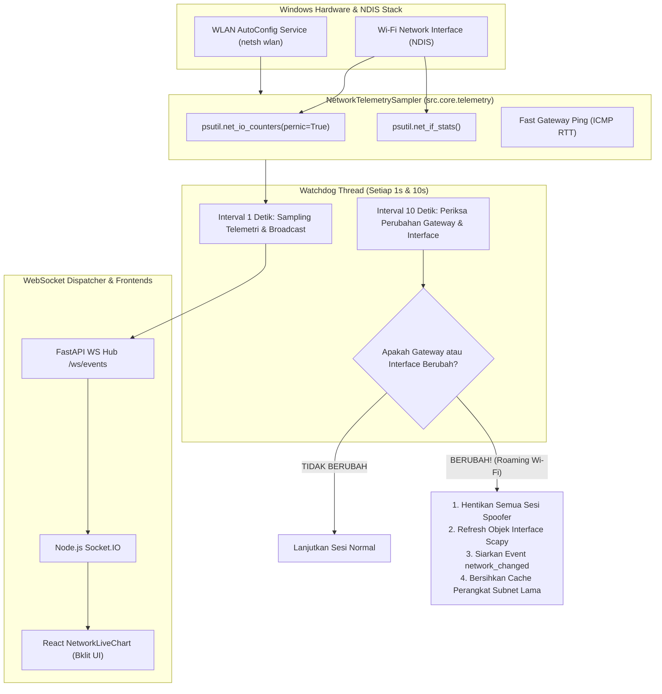

# SPEC-005: Real-Time Hardware Telemetry & Network Watchdog

| Metadata | Details |
| :--- | :--- |
| **Document ID** | SPEC-005 |
| **Status** | Approved / Implemented |
| **Version** | 2.1.0 |
| **Subsystem** | `python-service` (`src.core.telemetry`, `src.core.network`), `backend-node` |
| **Key Source Files** | `src/core/telemetry.py`, `src/core/network.py`, `src/server.py` |

---

## 1. Executive Summary

Aplikasi manipulasi jaringan memerlukan pemantauan kondisi link nirkabel dan beban bandwidth secara langsung dari adapter perangkat keras. Selain itu, ketika laptop operator berpindah access point Wi-Fi atau IP gateway berganti, sesi spoofing pada antarmuka lama harus dihentikan seketika untuk mencegah kebocoran paket pada jaringan baru.

SPEC-005 menetapkan arsitektur **Native Hardware Telemetry Sampler** (berbasis `psutil` dan `netsh wlan`) serta daemon **Network Watchdog** yang memonitor integritas link secara otonom.

---

## 2. Arsitektur Telemetri & Siklus Watchdog



---

## 3. Spesifikasi Perhitungan Throughput & Latensi

### 3.1 Throughput Download & Upload
Throughput dihitung berdasarkan delta byte yang diterima dan dikirimkan oleh adapter Wi-Fi:
$$\Delta 	ext{Bytes}_{	ext{recv}} = 	ext{Bytes}_{	ext{recv}}(t) - 	ext{Bytes}_{	ext{recv}}(t - \Delta t)$$
$$	ext{Download (Mbps)} = rac{\Delta 	ext{Bytes}_{	ext{recv}} 	imes 8}{\Delta t 	imes 1024 	imes 1024}$$
$$	ext{Upload (Mbps)} = rac{\Delta 	ext{Bytes}_{	ext{sent}} 	imes 8}{\Delta t 	imes 1024 	imes 1024}$$
Nilai dibulatkan hingga 2 desimal dengan interval sampling standar $\Delta t pprox 1.0	ext{ detik}$.

### 3.2 Gateway Ping Latency
Sistem melakukan pengukuran *Round Trip Time* (RTT) aktual ke alamat IP default gateway menggunakan Scapy ICMP probe cepat:
$$	ext{Latency (ms)} = (t_{	ext{reply}} - t_{	ext{sent}}) 	imes 1000$$

---

## 4. Skema Data Event Telemetri

### WebSocket Payload: `telemetry`
```json
{
  "event": "telemetry",
  "data": {
    "connected": true,
    "ssid": "Teman Kenangan",
    "signal": "82%",
    "download": 14.52,
    "upload": 2.18,
    "latency": 8,
    "timestamp": 1787823556656
  }
}
```
