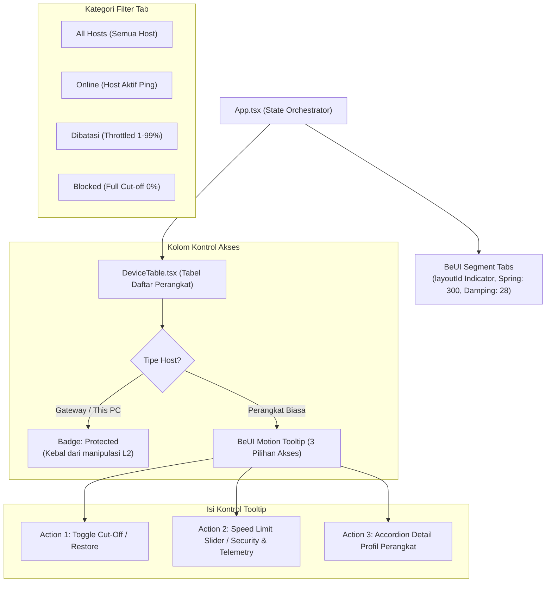

# SPEC-006: Modern Frontend UI, Motion Tabs & Action Tooltips

| Metadata | Details |
| :--- | :--- |
| **Document ID** | SPEC-006 |
| **Status** | Approved / Implemented |
| **Version** | 2.1.0 |
| **Subsystem** | `frontend-react` (`src.components.motion`, `src.components.DeviceTable`, `src.App`) |
| **Frameworks** | React 18, Tailwind CSS, Framer Motion, BeUI Motion Components |
| **Key Source Files** | `src/components/motion/tabs.tsx`, `src/components/motion/tooltip.tsx`, `src/components/DeviceTable.tsx`, `src/App.tsx` |

---

## 1. Executive Summary

Antarmuka pengguna NetCut Sentinel dirancang untuk memberikan pengalaman interaktif yang responsif, visual yang konsisten, serta kontrol akses jaringan yang intuitif tanpa mengorbankan performa rendering DOM.

SPEC-006 mendefinisikan implementasi komponen interaktif berbasis **BeUI Motion Tabs** (dengan filter segment berspring animasi) dan **BeUI Motion Tooltip** (menu akses multi-aksi mengambang), penataan ikon borderless netral, serta badge proteksi otomatis untuk host kebal (*Protected Badge*).

---

## 2. Struktur Desain Komponen Antarmuka

---

## 3. Spesifikasi BeUI Motion Tabs

Komponen navigasi filter tab mengadopsi varian **Segment Tabs** dari BeUI (`https://beui.dev/components/motion/tabs`):
- **Varian**: `variant="segment"`.
- **Indikator Aktif**: Menggunakan `motion.span` dengan properti `layoutId="active-segment"` yang berpindah mulus di bawah tombol tab yang aktif.
- **Fisika Animasi**:
  - `type: "spring"`
  - `stiffness: 300`
  - `damping: 28`
- **Tab Dibatasi (Throttled Filter)**:
  Filter dinamis yang menyaring perangkat dengan kondisi:
  $$	ext{speed\_limit} < 100 \land 	ext{speed\_limit} > 0$$

---

## 4. Spesifikasi BeUI Action Tooltip

Kolom akses perangkat menggantikan tombol dropdown lama dengan menu mengambang responsif:
- **Pemicu Hover**: `onPointerEnter` dan `onPointerLeave` untuk penanganan pointer yang andal di desktop maupun layar sentuh.
- **Aksessibilitas (A11y)**: Menggunakan atribut `aria-label` sebagai pengganti tag `title` native HTML guna mencegah tabrakan tooltip ganda.
- **Isi 3 Kontrol Akses**:
  1. **Tombol Toggle Power Wi-Fi**: Memutus (`speed_limit = 0`) atau memulihkan internet target seketika.
  2. **Tombol Bandwidth Limit**: Membuka modal pengaturan slider bandwidth atau mengarahkan ke tab Security & Telemetry.
  3. **Tombol Info Perangkat**: Membuka kartu spesifikasi teknis lengkap perangkat (OUI, port terbuka, opsi DHCP, workgroup).

---

## 5. Standar Visual & Konsistensi Ikon

1. **Gaya Ikon**: Seluruh ikon sub-menu ditampilkan dalam format *clean icon* tanpa border atau background berlebih.
2. **Warna Ikon**: Menggunakan palet netral yang konsisten (`text-gray-400 hover:text-white`) untuk menjaga estetika antarmuka modern bernuansa *dark mode*.
3. **Lebar Sidebar**: Disesuaikan proporsional agar hemat ruang horizontal tanpa memotong label teks navigasi.
