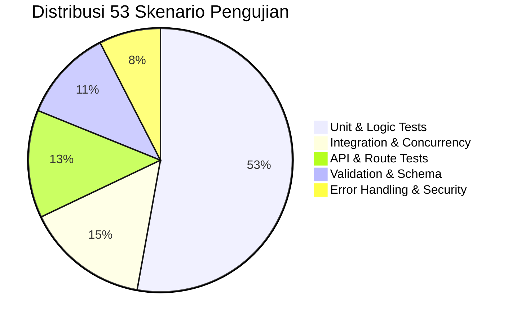

# SPEC-007: Automated Testing Architecture & Quality Assurance

| Metadata | Details |
| :--- | :--- |
| **Document ID** | SPEC-007 |
| **Status** | Approved / Implemented |
| **Version** | 2.1.0 |
| **Subsystem** | `python-service` (`tests/`), `backend-node` (`tests/`) |
| **Total Test Cases** | 53 Skenario Otomatis (100% PASS) |
| **Key Source Files** | `python-service/tests/*`, `backend-node/tests/*` |

---

## 1. Executive Summary

Untuk menjamin keandalan sistem manipulasi jaringan Layer 2 berkecepatan tinggi, toleransi kesalahan input, serta keamanan konkurensi multithreading, sistem dilengkapi **Automated Quality Assurance Suite** terpadu.

SPEC-007 mendokumentasikan metodologi pengujian 3 pilar (**Happy Path**, **Negative Test**, dan **Edge Cases**) yang mencakup Unit Testing, Integration Testing, API Testing, Database Testing, Validation Testing, dan Error Handling Testing di seluruh komponen backend.

---

## 2. Matriks Cakupan Pengujian (53 Test Cases)



---

## 3. Rincian Modul Pengujian

### 3.1 Python Service Test Suite (40 Tests)
Dijalankan via `.env\Scripts\python.exe -m unittest discover -s tests -p "test_*.py" -v`:
1. **`test_unit_network.py`**:
   - *Happy Path:* Alamat IPv4 private RFC 1918 valid (`192.168.x.x`, `10.x.x.x`, `172.16.x.x`), format MAC 6-oktet valid, resolusi self MAC & gateway.
   - *Negative:* Alamat IP publik (`8.8.8.8`), loopback (`127.0.0.1`), link-local (`169.254.x.x`), multicast (`224.0.0.1`), MAC tidak valid.
   - *Edge Cases:* Boundary address `0.0.0.0`, `255.255.255.255`, string kosong `""`, None, string 1.000 karakter.
2. **`test_unit_fingerprint.py`**:
   - *Happy Path:* Resolusi OUI vendor (Apple, Samsung, Xiaomi, Infinix, Espressif, TP-Link), klasifikasi OS (Windows, Android, iOS, Linux), dan tipe perangkat.
   - *Negative:* Vendor OUI tidak dikenal, format MAC rusak.
   - *Edge Cases:* Deteksi MAC acak (*Locally Administered bit* 2, 6, A, E), hostname kosong, TTL ekstrem (0, 255).
3. **`test_unit_discovery.py`**:
   - *Happy Path:* Metadata DHCP dengan Option 53 message type (`DISCOVER`, `REQUEST`, `ACK`, `RELEASE`).
   - *Negative:* Kunci IP kosong `""` atau `0.0.0.0` dicegah masuk ke cache.
   - *Edge Cases (Multithreaded Concurrency):* 20 thread konkuren melakukan *read & write* simultan (100 transaksi) untuk membuktikan integritas cache bebas dari *race condition* atau *dictionary resize error*.
4. **`test_unit_spoofer.py`**:
   - *Happy Path:* Siklus hidup sesi spoofing (start, update speed limit, stop, stop all).
   - *Negative:* Upaya spoofing gateway wajib ditolak (`SpoofError`), penghentian sesi tidak terdaftar melempar `SessionNotFoundError`.
   - *Edge Cases:* Clamping persentase limit (angka negatif di bawah 0 diklem ke 0, angka di atas 100 diklem ke 100, batas 0% dan 100%).
5. **`test_api_server.py`**:
   - *Happy Path:* Endpoint `/health`, `/api/wifi`, `/api/telemetry`, `/api/status`, `/api/spoof/start`, `/api/spoof/limit`, `/api/spoof/stop`.
   - *Negative:* HTTP 500 saat stop atau update session yang tidak ada.
   - *Edge Cases:* Permintaan spoof dengan batas ekstrem (0% full cut-off dan 100% normal).

### 3.2 Node.js Backend Test Suite (13 Tests)
Dijalankan via `npm test` (`ts-node tests/run_tests.ts`):
1. **`unit_database.test.ts`**:
   - *Happy Path:* Rekonsiliasi scan dengan DB; preservasi status `is_blocked = true` saat target masuk kembali; identifikasi otomatis `autoReblockTargets` (limit 0) dan `autoThrottleTargets` (limit 1-99%).
   - *Negative:* Target MAC belum tersimpan di DB.
   - *Edge Cases:* Array scan kosong `[]`, sanitasi parameterized query `$1` terhadap serangan SQL Injection (`' OR '1'='1; --`), pemotongan alias yang sangat panjang.
2. **`unit_deviceManager.test.ts`**:
   - *Happy Path:* Penyimpanan device, lookup gateway, pemblokiran perangkat.
   - *Negative:* Penolakan tegas pemblokiran gateway (`Cannot block the gateway`).
   - *Edge Cases:* Clamping speed limit, pencegahan duplikasi pemindaian paralel (*concurrent scan lock*).
3. **`api_routes.test.ts`**:
   - *Happy Path:* Struktur data endpoint health check.
   - *Negative:* Menolak `PUT /alias` tanpa alias atau non-string (HTTP 400); menolak `POST /limit` tanpa number atau `NaN` (HTTP 400).
   - *Edge Cases:* Penolakan string hanya spasi `"   "`.

---

## 4. Panduan Eksekusi Pengujian

```powershell
# 1. Menjalankan Test Suite Python Service
cd d:/spoorf/python-service
.\venv\Scripts\python.exe -m unittest discover -s tests -p "test_*.py" -v

# 2. Menjalankan Test Suite Node.js Backend
cd d:/spoorf/backend-node
npm test
```
