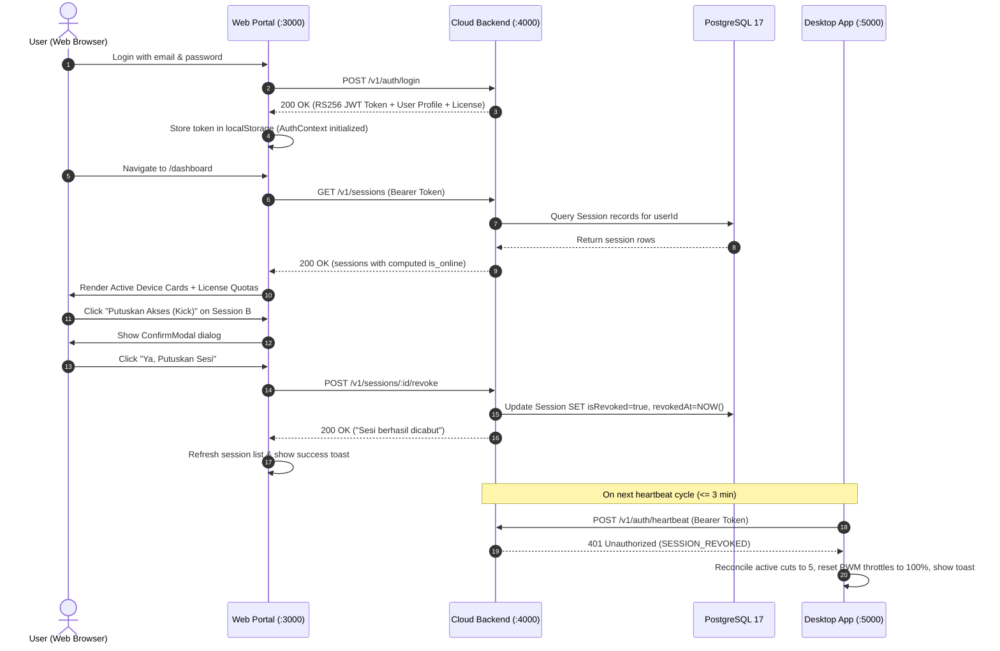

# Technical Design Specification: Cloud Web Portal & Active Session Management

**Document Version:** 1.0.0  
**Date:** 2026-09-21  
**Author:** Principal Systems Architect & Senior Full-Stack Engineer  
**Status:** Approved for Implementation  
**Governing Repositories:** `d:/spoorf-web-cloud` (Backend & Frontend), `d:/spoorf` (Desktop ecosystem integration)  

---

## 1. Executive Summary & Problem Statement

### 1.1 Background
The Spoorf ecosystem operates under a hybrid cloud-desktop model. Step 1 (implemented in `d:/spoorf`) equipped the desktop daemon (`backend-node`) with an automated background heartbeat loop, an offline sliding grace period (7 days), an active downgrade reconciler, and handling for remote session revocation (`SESSION_REVOKED` 401).

### 1.2 Problem
Currently, the cloud web frontend (`spoorf-web-cloud/frontend`) is an empty skeleton (`.gitkeep`). A user who reaches their concurrent session limit (e.g. Free: 1 slot, Pro: 2 slots, VIP: 5 slots) or suspects their account is being used on an unknown machine has no user-facing interface to inspect active sessions or trigger a remote kick. Without a web portal, the desktop session lifecycle loop remains unclosed for end-users.

### 1.3 Solution (Pillar A)
Build the complete **Web Portal & Remote Session Management Subsystem**:
1. **Backend REST API (`spoorf-web-cloud/backend`)**: Expose authenticated endpoints to list user sessions (`GET /v1/sessions`), revoke a specific session (`POST /v1/sessions/:id/revoke`), and revoke all other active sessions (`POST /v1/sessions/revoke-all`).
2. **Frontend Web Portal (`spoorf-web-cloud/frontend`)**: Build a reactive Single Page Application (SPA) using React 18, TypeScript, Vite, Tailwind CSS, `react-router-dom`, and strictly professional vector icons from `lucide-react` adopting the iconic **Sentinel Cyber-Dark Unified Theme**.

---

## 2. System Architecture & Data Flow



---

## 3. Backend API Specification (`spoorf-web-cloud/backend`)

All routes are mounted at `/v1/sessions` and `/api/v1/sessions`. All endpoints require the `requireAuth` middleware (Bearer RS256 JWT).

### 3.1 `GET /v1/sessions`
- **Purpose:** Retrieve all sessions associated with `req.user.id`.
- **Query / Ordering:** `orderBy: { lastSeenAt: 'desc' }`.
- **Computed Field:** `is_online: boolean` evaluates to `true` if and only if `!isRevoked && (Date.now() - new Date(lastSeenAt).getTime() < 5 * 60 * 1000)`.
- **Response Format:**
  ```json
  {
    "success": true,
    "sessions": [
      {
        "id": "c6b41295-ff08-410a-b328-97ffb7a2d3e1",
        "sessionId": "client-uuid-1",
        "deviceName": "Laptop Asus ROG - Win11",
        "platform": "win32",
        "appVersion": "2.41.79",
        "ipAddress": "114.122.35.12",
        "isRevoked": false,
        "revokedAt": null,
        "revokedReason": null,
        "lastSeenAt": "2026-09-21T10:45:00.000Z",
        "createdAt": "2026-09-21T08:00:00.000Z",
        "is_online": true
      }
    ]
  }
  ```

### 3.2 `POST /v1/sessions/:id/revoke`
- **Purpose:** Soft-revoke a specific session by database `id` or client `sessionId`.
- **Authorization Guard:** Multi-tenant verification. The target session must belong to `req.user.id`. If not found or belongs to another user, return `404 Not Found` (anti-enumeration).
- **Database Mutation:**
  ```ts
  await db.session.update({
    where: { id: session.id },
    data: {
      isRevoked: true,
      revokedAt: new Date(),
      revokedReason: "Dicabut secara manual oleh pengguna melalui Web Dashboard"
    }
  });
  ```
- **Response Format (200 OK):**
  ```json
  {
    "success": true,
    "message": "Sesi berhasil dicabut."
  }
  ```

### 3.3 `POST /v1/sessions/revoke-all`
- **Purpose:** Emergency revocation of all active sessions for the current user.
- **Database Mutation:**
  ```ts
  const res = await db.session.updateMany({
    where: {
      userId: req.user.id,
      isRevoked: false
    },
    data: {
      isRevoked: true,
      revokedAt: new Date(),
      revokedReason: "Dicabut massal oleh pengguna melalui Web Dashboard"
    }
  });
  ```
- **Response Format (200 OK):**
  ```json
  {
    "success": true,
    "revokedCount": 2,
    "message": "Semua sesi aktif berhasil dicabut."
  }
  ```

### 3.4 `GET /v1/download/latest`
- **Purpose:** Provide release metadata and installer download link for the desktop client.
- **Response Format (200 OK):**
  ```json
  {
    "success": true,
    "release": {
      "version": "2.41.79",
      "platform": "windows-x64",
      "filename": "Spoorf Sentinel Setup 1.0.0.exe",
      "downloadUrl": "/downloads/Spoorf%20Sentinel%20Setup%201.0.0.exe",
      "releaseNotes": "Background heartbeat, sliding 7-day grace window, and remote kick reconciler."
    }
  }
  ```

---

## 4. Frontend Web Portal Specification (`spoorf-web-cloud/frontend`)

### 4.1 Technology Stack & Strict Visual Invariant
- **Framework:** React 18 + Vite 5 + TypeScript 5.
- **Routing:** `react-router-dom` v6.
- **Styling:** Tailwind CSS 3 (Dark Slate/Zinc-950 palette, cyan/emerald accents, glassmorphism).
- **Icons:** Strictly `lucide-react` vector icons (`Shield`, `Laptop`, `Monitor`, `PowerOff`, `RefreshCw`, `AlertTriangle`, `CheckCircle2`, `Download`, `LogOut`, `Key`, `User`, `Wifi`, `WifiOff`, `Terminal`, `Lock`). **NEVER use text emojis or browser default icons.**

### 4.2 Modular File Structure
```text
d:/spoorf-web-cloud/frontend/src/
├── context/
│   └── AuthContext.tsx           # Global session state, auto rehydration, logout
├── services/
│   ├── api.ts                    # Axios instance with Bearer interceptor and 401 handler
│   └── sessionService.ts         # getSessions(), revokeSession(), revokeAllSessions()
├── types/
│   ├── auth.ts                   # User, License, LoginCredentials, RegisterCredentials
│   └── session.ts                # DeviceSession, SessionRevokeResponse
├── components/
│   ├── layout/
│   │   └── Navbar.tsx            # Sentinel branding, tier badge, navigation, profile dropdown
│   └── common/
│       ├── ProtectedRoute.tsx    # Auth guard with cyber pulse spinner
│       ├── ConfirmModal.tsx      # Confirmation dialog for destructive kick actions
│       └── Toast.tsx             # Floating feedback toast for actions
└── pages/
    ├── LoginPage.tsx             # Cyber-Dark login form
    ├── RegisterPage.tsx          # Cyber-Dark registration form
    ├── DashboardPage.tsx         # Metric overview & active session management cards
    └── DownloadPage.tsx          # Official installer binary download portal
```

### 4.3 UI Component Details

#### 4.3.1 `DashboardPage.tsx`
- **Header Metric Cards:**
  - **License Tier Card:** Displays `FREE`, `PRO`, or `VIP` with glowing cyber badge.
  - **Slot Usage Indicator:** Shows `X / Y Devices` (e.g. `1 / 2 Slots Active` for PRO).
  - **Network Enforcement Capabilities:** Max cuts quota (e.g. 5 on Free, 15 on Pro, 30 on VIP) and PWM / Gateway Sinkhole availability.
- **Session Control Toolbar:**
  - Refresh button with animated spin icon (`RefreshCw`).
  - Emergency button: `"Putuskan Semua Sesi Lain"` (`PowerOff` icon, red danger styling).
- **Device Card Grid:**
  - Rendered per session.
  - Platform Icon: `Laptop` or `Monitor` based on platform.
  - Status Indicator:
    - 🟢 Glowing Emerald Pill: `Online` (heartbeat < 5m ago).
    - 🟡 Amber Pill: `Idle / Offline` (> 5m ago).
    - 🔴 Red Pill: `Dicabut` (Revoked).
  - Metadata: Device Name, OS platform, IP address, App Version, Last Seen.
  - Action Button: Red outline `"Putuskan Akses"` opening `ConfirmModal`.

#### 4.3.2 `ConfirmModal.tsx`
- Modal dialog with `AlertTriangle` warning icon.
- Displays target device name and explains consequences:
  *"Aplikasi desktop pada perangkat ini akan segera diturunkan ke paket Free dan pemutusan jaringan aktif akan direkonsiliasi."*
- Actions: `[Batal]` (gray outline) and `[Ya, Putuskan Sesi]` (solid red).

#### 4.3.3 `DownloadPage.tsx`
- Clean distribution view with `Download` icon.
- Direct download button for `Spoorf Sentinel Setup.exe`.
- System requirements: Windows 10/11 64-bit, Npcap driver, Administrator privileges.

---

## 5. Security & Invariant Compliance

1. **Multi-Tenant Isolation (P0):** All session queries and mutations MUST strictly scope by `userId = req.user.id`. A user cannot view, probe, or revoke any session belonging to another user.
2. **Zero Network Telemetry Invariant (P0):** The cloud web portal and cloud backend NEVER collect, store, or display local target IP addresses, spoofed target MACs, or DNS queries intercepted by the desktop app. Only the operator's public IP, client OS, and client app version are stored in `Session`.
3. **Core Desktop Invariants (P0):** Desktop Invariant 1 (Gateway Immunity) and Invariant 2 (Controller Self-Protection) remain completely inviolable. When a desktop receives a remote kick from this web portal, it downgrades safely without touching gateway or host.

---

## 6. Verification & Automated Test Strategy

### 6.1 Backend Integration Tests (`spoorf-web-cloud/backend`)
- **Suite:** `tests/session.test.ts`
  - `GET /v1/sessions`: Successfully lists sessions for authenticated user.
  - `GET /v1/sessions`: Rejects unauthenticated requests with 401.
  - `POST /v1/sessions/:id/revoke`: Soft-revokes target session and updates DB.
  - `POST /v1/sessions/:id/revoke`: Rejects attempt to revoke session belonging to another user (404/403).
  - `POST /v1/sessions/revoke-all`: Successfully revokes all active sessions for current user.
- **Target:** 100% passing tests in `npm test`.

### 6.2 Frontend Type-Check & Production Build (`spoorf-web-cloud/frontend`)
- Run `tsc --noEmit` to verify strict typing.
- Run `npm run build` (`tsc && vite build`) to verify bundle integrity and zero resolution errors.

### 6.3 Desktop Ecosystem Verification (`d:/spoorf`)
- Run `npm test` in `backend-node` (132 passed).
- Run `python -m unittest discover` in `python-service` (430 passed).
- Ensure all **562 automated tests** remain completely green.
